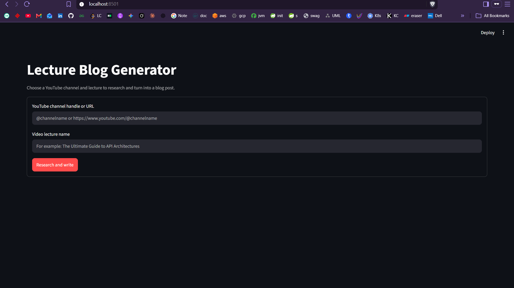
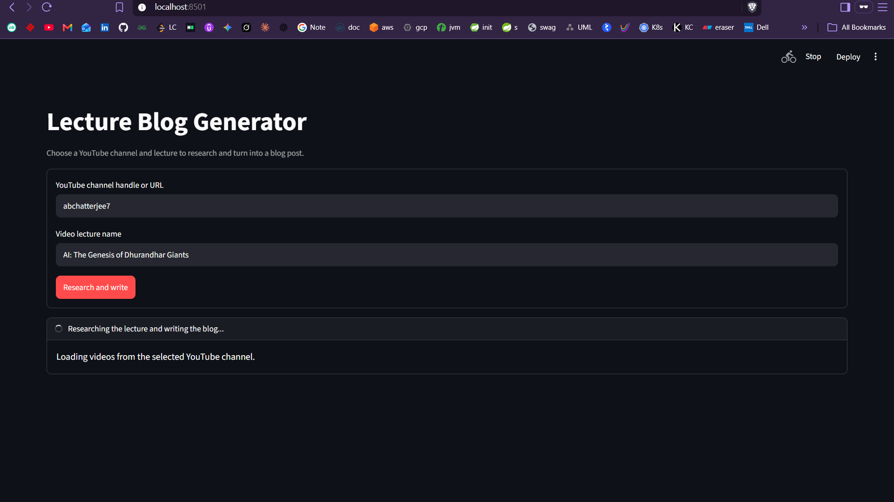

# YouTube Blog Generator with CrewAI

A small CrewAI multi-agent project that researches videos from a YouTube channel and turns a selected lecture name into a Markdown blog post. Enter the channel handle or URL and lecture name in Streamlit. The app displays the submitted input, research result, and final blog. The agents use Google Gemini for text generation.

> **Current behavior:** this project searches a YouTube channel by lecture name; it does not upload or read a local video file. Enter a channel `@handle`, channel ID, or supported YouTube channel URL, not just its display name.

## How It Works

The crew runs two agents sequentially:


1. **Blog researcher** uses the YouTube channel search tool to find information for the requested topic and prepares a short research report.
2. **Blog writer** uses the research result to draft a readable blog post.
3. Streamlit displays the research and final blog, with an option to download the blog as Markdown.

YouTube search embeddings use Chroma's local ONNX model. Each selected channel gets a separate vector collection; `GEMINI_API_KEY` is used for Gemini text generation.

## Run on Windows

Open PowerShell in the project folder. Create and activate the virtual environment if you do not already have one:

```powershell
py -3.12 -m venv venv
.\venv\Scripts\Activate.ps1
```

Install dependencies:

```powershell
python -m pip install --upgrade pip
python -m pip install -r requirements.txt
```

Create `.env` from `.env.example` only if `.env` does not already exist, then ensure it contains your Gemini API key and model:

```dotenv
GEMINI_API_KEY=your_gemini_api_key
GEMINI_MODEL_NAME=gemini/gemini-3.8-flash
```

Keep your real key private. `.env` is ignored by Git; do not commit it or paste the key into source code. Set `GEMINI_MODEL_NAME` to a Gemini model available to your account.

Launch Streamlit from the project folder:

```bash
python -m streamlit run app.py
```

Open the Local URL printed by Streamlit (usually `http://localhost:8501`). Enter a YouTube channel handle or URL and a lecture name. The app searches that channel and displays the input, each task's output, and the final blog.



- When you feed the blanks and the app is processing...


## Customize the Run

- **YouTube channel:** enter a channel `@handle`, channel ID, or supported channel URL in the Streamlit form.
- **Model:** set `GEMINI_MODEL_NAME` in `.env` to a Gemini model available to your account.

The current search is channel-based. A display name by itself is not enough to identify a channel reliably. Supporting an uploaded/local video or selecting an arbitrary video URL requires changing the YouTube tool and the task input flow.

## Project Structure

| File | Purpose |
| --- | --- |
| `agents.py` | Defines the researcher and writer agents and their Gemini LLM. |
| `tasks.py` | Builds the research and writing tasks for each run. |
| `tools.py` | Configures channel search and local ONNX embeddings. |
| `crew.py` | Creates and runs the sequential crew for a topic. |
| `app.py` | Streamlit UI for lecture input, task output, and blog display. |
| `requirements.txt` | Python dependencies installed into `venv`. |
| `.env.example` | Template for Google Gemini configuration; copy to `.env`. |


## Security

Never commit `.env` or expose your Gemini API key in logs, screenshots, source code, or public issue reports. If a key is exposed, revoke it and create a replacement.
